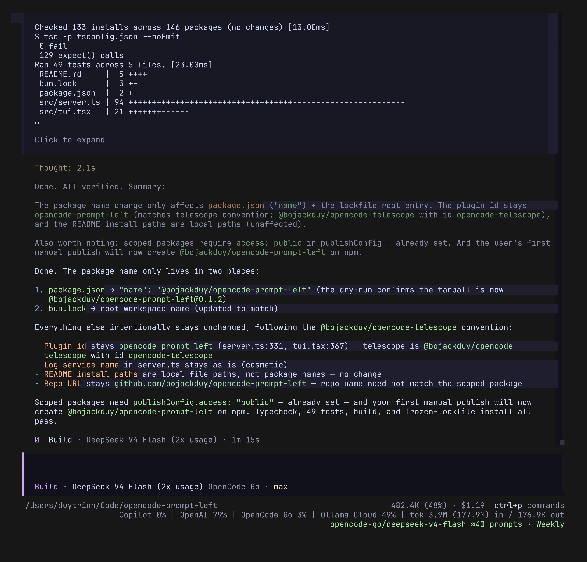

# opencode-prompt-left

Estimates how many **similar prompts** remain before your provider quota runs out, shown in the OpenCode compact line (next to the prompt box).

```
≈14 prompts · Weekly            ← compact line (best estimate)
```



The number is a forward forecast of your own usage: recent per-prompt workload (cost, requests, tokens in/out, cache read/write, tool calls, subagents), projected against the current context/compaction state, then converted to quota burn using the observed percentage-per-dollar rate of each quota window.

## Install

Install from npm (published as `@bojackduy/opencode-prompt-left`). The same
package provides both the server plugin and the TUI plugin — opencode resolves
the right entrypoint (`./server` / `./tui`) from the config file it appears in:

```jsonc
// opencode.jsonc
{
  "plugin": ["@bojackduy/opencode-prompt-left"]
}
```

```jsonc
// tui.json
{
  "plugin": ["@bojackduy/opencode-prompt-left"]
}
```

> To use a local clone instead (development):
>
> ```jsonc
> // opencode.jsonc
> { "plugin": ["/path/to/opencode-prompt-left/src/server.ts"] }
> // tui.json
> { "plugin": ["/path/to/opencode-prompt-left/src/tui.tsx"] }
> ```

Restart OpenCode. State persists per project directory at `$XDG_CACHE_HOME/opencode/prompt-left/<workspace-hash>/`:

- `history.json` — root-prompt usage telemetry and per-window quota-rate observations (survives restarts)
- `estimate.json` — the current estimate, consumed by the TUI

## Core formula

```
predicted cost per prompt  = recency-weighted EWMA of recent root-prompt costs
                             (cost, requests, tokens in/out/reasoning, cache r/w,
                              tool calls, tool output, child sessions)

plan budget per window     = known dollar limits (OpenCode Go: $12/5h, $30/week,
                             $60/month — overridable in prompt-left.json)

prompts left               = (budget × remaining%) ÷ predicted cost per prompt
```

For providers with known plan budgets the estimate is **exact** — it converts
the reported remaining percentage into remaining dollars and divides by your
real per-prompt cost. For other providers it falls back to observed
quota-per-dollar rates (`Δpercent ÷ local cost`), then to a prior.

Per-window resolution order: **plan budget → quota-rate observations → prior**.
The binding window is the one with the fewest prompts left (e.g. Weekly usually
binds over 5h).

- A **root prompt** is one top-level user message, including everything it spawned: tool loops, retries, child/subagent sessions, and compaction.
- Workload comes from OpenCode's exact `step-finish` usage records (per-request tokens and cost), deduplicated — not cumulative message snapshots.
- Each quota window (5h / Weekly / Monthly) has its own rate. Rates are computed only from percentage changes that coincide with local usage; zero-delta polls keep accumulating cost so unchanged percentages are never miscounted as free prompts.
- Compaction: the trigger threshold mirrors OpenCode's own overflow check (`context tokens ≥ usable`), and post-compaction context is modeled as summary + ~25% retained tail (2k–15k tokens).
- The compact line shows the **best estimate**; the detail view also shows a conservative bound, confidence, and the full forecast breakdown.

## Status

| Compact line | Meaning |
|---|---|
| `opencode-go/deepseek-v4-flash ≈54 prompts · Weekly` | plan-budget estimate (real per-prompt cost ÷ remaining dollars), green/yellow/red by capacity |
| `copilot/gpt-5.6 ≈0 prompts · Copilot` | plan-limit estimate (remaining requests ÷ requests per prompt) |
| `opencode-go/deepseek-v4-flash $1.20 left · Weekly` | budget known but no usage history yet — exact dollars, count appears after a few prompts |
| `no quota · claude-code-ollama` | provider is not tracked by opencode-quota (free model, local provider, or not enabled) |
| `≈2 prompts · Weekly` (low confidence) | prior estimate — no plan limit and no observations |
| `no quota` | no usable quota export found |

`/prompts-left` opens the full breakdown: best/safe counts, binding window + reset countdown, per-provider windows, forecast per prompt (cost, requests, tools, cache), context/compaction horizon, and calibration stats.

## When does it recalculate?

### Model selection

opencode never publishes a "model changed" event — the selection lives in the
TUI's in-memory store and reaches the server only at prompt-submit. prompt-left
works around that with a file bridge plus per-message signals:

```
model picker → TUI writes ~/.local/state/opencode/model.json (recent[0] = selection)
             → prompt-left TUI plugin watches it (300ms) → writes selection.json
             → prompt-left server plugin watches it → overrideSelection → recompute
```

Both sides watch their files with a **poll safety net** (5s) in addition to
fs.watch — even if a watch event is missed or coalesced, the next poll picks
the change up and deduplicates, so nothing is lost and unchanged files never
trigger recomputes.

| You do this | What fires | Result |
|---|---|---|
| Pick a model in the picker | `model.json` write → `selection.json` → server watcher → `overrideSelection` | ✅ recompute in <1s, no prompt needed |
| Favorite cycle (`model.cycle_favorite`) | same path (`cycleFavorite` also saves `recent`) | ✅ recompute in <1s |
| Tab cycle (`model.cycle_recent`) | nothing is written anywhere by opencode | ⚠️ no immediate recompute; updates at the next prompt submit |
| Submit a prompt | `chat.message` hook (`noteSelection` + `beginPrompt`) | ✅ recompute (~1s debounce) |
| A real user message arrives (no active prompt, e.g. after restart mid-session) | `message.updated` event | ✅ recompute |
| `session.next.model.switched` event | opencode emits it (only if something calls the switch API) | ✅ recompute |
| Open a different session / restart / resume from another directory | TUI writes `active.json` (on mount + every 2.5s) with the session's **last-used model**; server applies it as the baseline | ✅ recompute ≤2.5s |

The **tab-cycle blind spot** exists because opencode persists nothing for it;
it self-corrects at submit.

### Any other trigger

Every recompute (1s debounce) updates `estimate.json`, which the TUI polls
every 2.5s:

| Trigger | Source |
|---|---|
| `session.created` / `session.deleted` / `session.idle` / `session.compacted` | server event hook |
| `message.updated` / `message.part.updated` / `message.removed` | server event hook (usage + tool + context accounting) |
| `session.next.agent.switched` | server event hook |
| Quota snapshot advances (every 60s poll, or on demand) | `readQuotaSnapshot()` → per-window rate observations |
| `selection.json` / `active.json` change | server fs.watch on the workspace state dir |
| `prompt-left.json` config edit (budgets) | server fs.watch on the config dir |
| Plugin dispose | finalize + recompute |

### Selection resolution (per session)

`real events → picker bridge (by recency) → active.json baseline (only when the
session's selection is unknown)`. The estimate follows the **session you're
currently viewing**, not a global "current model":

## Multi-directory isolation

opencode-prompt-left runs one plugin instance per opencode process, and every instance (one per project directory, even simultaneously) keeps its own state:

```
$XDG_CACHE_HOME/opencode/prompt-left/<workspace-hash>/
  history.json      prompt usage + quota-rate observations for THIS directory
  estimate.json     the current estimate for THIS directory
  selection.json    model-picker bridge for THIS directory
  active.json       which session is open in THIS directory
```

The workspace hash is derived from the project directory, so:

- Running several directories **at the same time** never races on shared files — no cross-talk, no flicker.
- Each directory calibrates its own workload and quota rates (cold-starts per directory; that's the price of accuracy).
- Sessions with different models inside one directory each keep their own selection, and the estimate follows whichever one you have open.

## Coexisting with opencode-quota

prompt-left renders its line at the bottom, directly below opencode-quota's compact line — no quota configuration or patches needed:

```
[ prompt input box        ]
Copilot 94% | OpenAI 5h 100%   ← opencode-quota
≈14 prompts · Weekly           ← prompt-left
```

- If opencode-quota owns the prompt bar (`tuiCompactStatus.sessionPrompt: true`), prompt-left appends only its line below quota's.
- If quota's session prompt is disabled, prompt-left renders the prompt bar itself and keeps its line below it.

Either way both plugins stay fully enabled.

## Requirements

## Plan limits

`~/.config/opencode/prompt-left.json` lets you give any provider an exact
conversion from its reported percentage to prompts. Three kinds of limits are
supported; the estimator uses the first that applies per window:

| Kind | Field | Converts via | Defaults (built in) |
|---|---|---|---|
| Dollar budget | `budgets` | per-prompt **cost** | `opencode-go`: $12/5h, $30/week, $60/month · `copilot`: $15/month (1,500 AI credits @ $0.01, Pro) |
| Request limit | `limits` | per-prompt **requests** | `copilot` "Copilot Premium Interactions": 300/month (Pro) |
| Token allowance | `tokenLimits` | per-prompt **tokens** | — |

```jsonc
// ~/.config/opencode/prompt-left.json
{
  "budgets": {
    "opencode-go": { "5h": 12, "Weekly": 30, "Monthly": 60 }
  },
  "limits": {
    "openai": { "Weekly": 8000 }          // e.g. GPT-5.6 tier, plan-page value
  },
  "tokenLimits": {
    "ollama-cloud": { "Weekly": 1000000 } // from your ollama.com plan page
  }
}
```

Window keys match the quota provider's labels (`5h`, `Weekly`, `Monthly`,
`Session`, …); the entry name is also matched as a fallback. Without a plan
limit, a provider falls back to observed quota-per-dollar rates, then to a
prior placeholder. The file is watched — edits apply on the next recompute.

Built-in defaults and their sources:

- `opencode-go` — official usage-limits docs: $12 / 5h, $30 / week, $60 / month.
- `copilot` "Copilot" — GitHub AI Credits (1 credit = $0.01); Copilot Pro
  includes 1,500 credits/month (1,000 base + 500 flex) = $15/month
  ([usage-based billing](https://docs.github.com/en/copilot/concepts/billing/usage-based-billing-for-individuals)).
  The quota plugin's percentage refers to these credits, so it converts via
  per-prompt cost (credits are dollars).
- `copilot` "Copilot Premium Interactions" — legacy premium-request allowance,
  300/month on Pro.

OpenAI (ChatGPT Pro weekly) and Ollama Cloud are **config-driven by design**:
their absolute limits are not published (ChatGPT Pro allowances differ by tier
and model; Ollama Cloud bills model-weighted "usage units", explicitly *not* a
fixed token count). Fabricating defaults would look reliable but be wrong — so
they fall back to rate observations, then a prior, until you add their values
to `prompt-left.json`.

## Development

```sh
bun install
bunx tsc --noEmit
bun test
```

## Releasing

Releases are tag-triggered and published with **trusted publishing** (OIDC — no
npm token in CI, provenance attestations included).

- First release: publish manually once so the package exists on npm:
  `npm publish --access public` (after that, CI can publish via OIDC).
- Subsequent releases:

```sh
bun run release:patch   # or release:minor / release:major
```

This bumps the version, creates the `v*.*.*` tag, pushes it, and the
`Publish npm package` workflow runs typecheck/test/build and publishes with
provenance.

## Notes and limitations

- Estimates are statistical. "≈N similar prompts" means *if you keep prompting like your recent root prompts do, in the current context state*.
- Quota-rate calibration needs at least one observable percentage change on the selected provider's windows; until then the compact line shows the remaining percentage and the forecast cost.
- Quota observations arrive at opencode-quota's refresh interval (~5 min), so rate observations are per interval, not per prompt.
- Quota used by other machines/windows is detected as external burn and lowers confidence.
- A window can reset before you exhaust it at your pace; the detail view shows reset countdowns.
